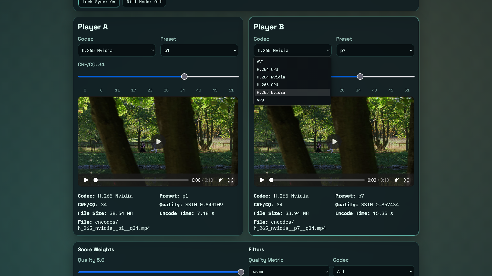
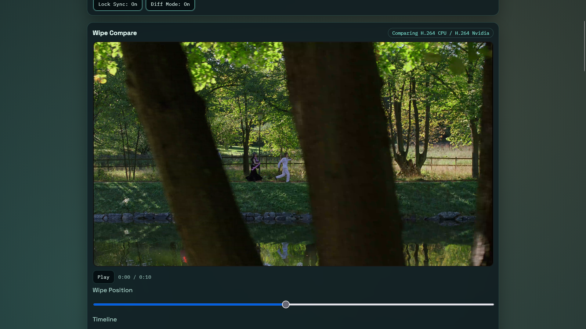
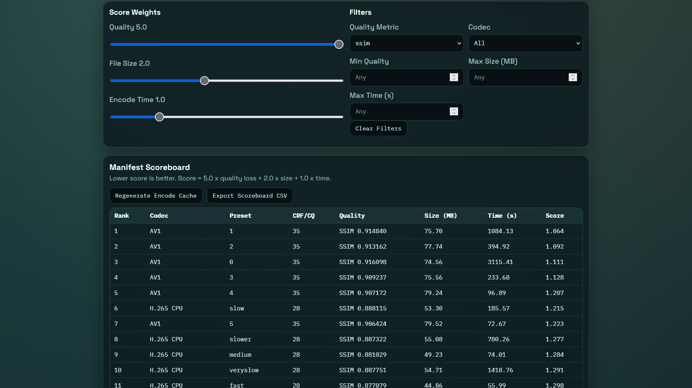

# FractumSeraph's Encoding Comparisons

This project lets you generate a large FFmpeg encode matrix and then interactively compare output quality, file size, and encode time in a browser.

## Live Demo

https://encoding.26001337.xyz

## Screenshots

### Compare View

### Wipe Compare View

### Ranking View

## Files

- batch_encode.py: batch encoder with resumable manifest tracking.
- manifest.json: generated results file used by the frontend.
- index.html, style.css, script.js: interactive viewer.
- run_encode.ps1: helper script to run the encoder.
- serve_viewer.ps1: helper script to start a local web server.

## Requirements

- Python 3.9+
- FFmpeg installed and available on PATH

Check FFmpeg:

ffmpeg -version

## Quick Start

1. Place your source video in this folder as source.mp4
2. Run the encoder:

python batch_encode.py

Recommended faster run (non-linear + parallel lanes):

python batch_encode.py --schedule interleave --cpu-workers 2 --gpu-workers 1

Choose a quality metric:

python batch_encode.py --quality-metric ssim

python batch_encode.py --quality-metric psnr

python batch_encode.py --quality-metric vmaf

Compute all metrics in one run:

python batch_encode.py --quality-metrics all --quality-metric ssim

Custom multi-metric set:

python batch_encode.py --quality-metrics ssim,psnr --quality-metric ssim

3. Start a local server:

python -m http.server 8000

4. Open in browser:

http://localhost:8000/

## Windows Helpers

Run encoding:

./run_encode.ps1

Serve frontend:

./serve_viewer.ps1

## What Gets Encoded

Codecs mapped to FFmpeg encoders:

- H.264 CPU -> libx264
- H.264 Nvidia -> h264_nvenc
- H.265 CPU -> libx265
- H.265 Nvidia -> hevc_nvenc
- AV1 -> libsvtav1
- VP9 -> libvpx-vp9

Preset behavior:

- x264 and x265: ultrafast to placebo
- NVENC: p1 to p7
- AV1 (SVT): preset -1 to 13
- VP9: deadline best, good, realtime

Quality points:

- Uses exactly 10 integer values per codec range
- Includes minimum and maximum, plus 8 evenly spaced values in between

Range summary:

- x264, x265, NVENC: 0 to 51
- AV1, VP9: 0 to 63

Codec-specific flags:

- NVENC uses -cq (not -crf)
- VP9 uses -crf with -b:v 0

## Resumability and Manifest

- The encoder writes successful entries to manifest.json as it progresses.
- On rerun, it skips combinations already present in manifest.json.
- This allows you to stop and continue later without redoing finished jobs.

Each manifest entry includes:

- codec_name
- preset
- crf_value
- encode_time_seconds
- file_size_bytes
- quality_metric
- quality_score
- output_filename

Visual quality:

- The encoder computes an objective post-encode quality score against the original source.
- FFmpeg metrics: SSIM, PSNR, and VMAF (when the required FFmpeg filter is available).
- GPU metrics: SSIMULACRA2, Butteraugli, and CVVDP via the FFVship CLI (Vship; releases at https://codeberg.org/Line-fr/Vship/releases). On Windows, run `install_metrics.ps1` to install FFVship (use `-AssetUrl <url>` if auto-detection misses); metrics whose tool is missing are skipped automatically.
- `--quality-metrics` defaults to `all`; keep one primary metric (used for ranking) via `--quality-metric`.
- The scoreboard shows every available metric as its own column. Note Butteraugli is lower-is-better (marked with a down arrow); all others are higher-is-better.
- Existing manifest entries missing requested metrics are backfilled on later runs without re-encoding.

Stopping safely:

- Press Ctrl+C to stop the current run.
- Active ffmpeg processes are terminated.
- Finished jobs already written to manifest stay recorded.
- Incomplete jobs are retried next run.

## Speed Optimization (No More Strict Linear Order)

The encoder now supports schedule strategies and worker lanes.

Schedule options:

- linear: old style nested order
- interleave (default): round-robin across codec/preset buckets so you get broad coverage early
- fast-first: prioritizes likely faster jobs first for quicker visible results

Examples:

python batch_encode.py --schedule interleave

python batch_encode.py --schedule fast-first

Parallel lanes:

- --cpu-workers N controls concurrent CPU codec jobs
- --gpu-workers N controls concurrent NVENC jobs

Examples:

python batch_encode.py --cpu-workers 2 --gpu-workers 1

python batch_encode.py --schedule fast-first --cpu-workers 3 --gpu-workers 1

Planning and batching:

- --dry-run prints planned jobs without encoding
- --max-jobs limits queued work for short test passes

Examples:

python batch_encode.py --dry-run --schedule interleave

python batch_encode.py --max-jobs 40 --schedule fast-first

## Frontend Behavior

- UI options are generated from manifest data only.
- Completed encodes are read directly from manifest.json (no per-file existence probing).
- The viewer auto-refreshes manifest changes in the background while open and also supports manual Reload Manifest.
- Viewer preferences persist across sessions, including player selections, lock sync, diff mode, weights, filters, and active player.
- Frame stepping uses the source video's frame rate from the manifest when available.
- Two independent players (A and B) each have their own Codec, Preset, and CRF controls.
- Preset lists are ordered from faster to slower by codec family (instead of alphabetical sorting).
- Source switching preserves playback timestamp in each player for seamless comparison.
- Metadata under each player shows settings, encoded size in MB, and encode time.
- Metadata under each player also shows the recorded visual quality score.
- Scoreboard table ranks encodes by weighted normalized size, time, and quality loss.
- You can tune the score weights live in the browser.
- You can filter the table by codec, minimum quality, maximum size, and maximum encode time.

### Keyboard Shortcuts

- 1: focus Player A
- 2: focus Player B
- Space: play or pause focused player
- ,: step focused player back by 1 frame
- .: step focused player forward by 1 frame
- Q: toggle spotlight mode between A and B
- S: sync Player B timestamp to Player A
- L: toggle continuous lock-sync mode
- D: toggle side-by-side wipe compare mode
- E: export scoreboard CSV

### Advanced Compare Features

- Lock Sync mode keeps Player A and Player B time-aligned while playing.
- Wipe compare mode overlays Player A on Player B with a draggable wipe slider plus a shared play/pause and timeline seek bar.
- Scoreboard CSV export saves ranked rows for external analysis.

## Troubleshooting

### NVENC encoders are skipped

Your FFmpeg build likely has no NVIDIA support. Install an FFmpeg build with NVENC enabled and NVIDIA drivers present.

### Browser cannot load manifest

Open through a local server rather than file browsing:

python -m http.server 8000

### Some codec families are skipped

batch_encode.py detects available encoders in your local FFmpeg build and skips unsupported ones.

## Suggested Workflow

1. Run a first pass overnight.
2. Refresh the browser and inspect quality at key scenes.
3. Keep notes on acceptable CRF by codec and preset.
4. Add or adjust matrix options in batch_encode.py and rerun.

## Note

Encoded files are written under encodes/ and can get large quickly.
